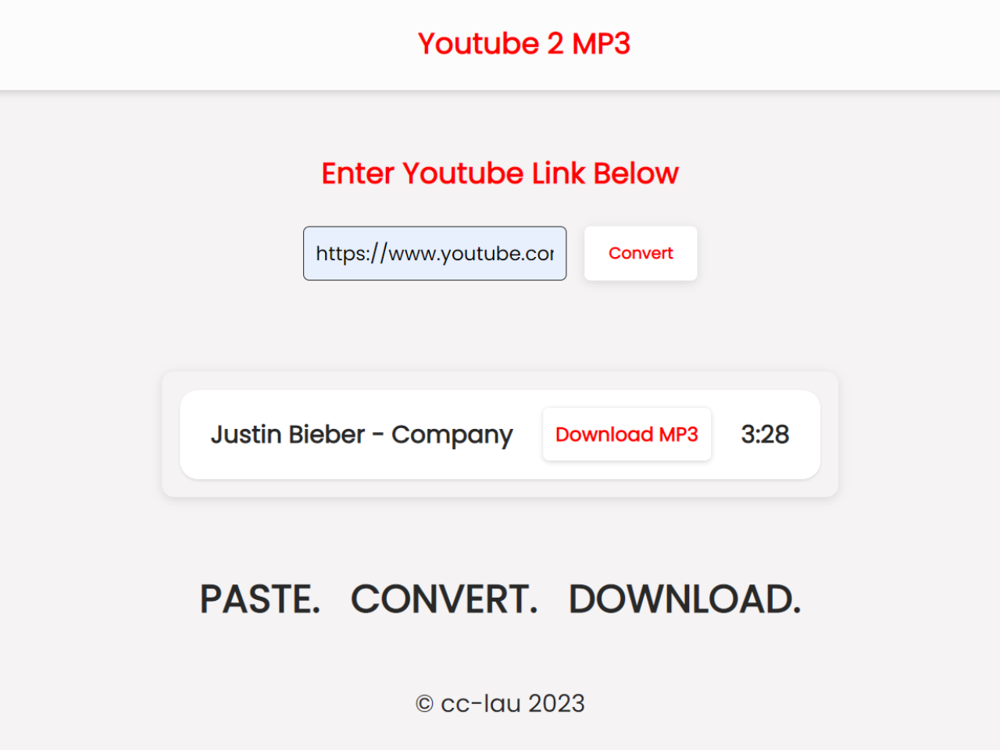

 

<h2>About the project</h2>

  
This project is a <b>YouTube to MP3 converter</b> website. Copy any youtube video link and paste it into the input field. Press convert and you can now download the Youtube Video's audio in an MP3 format!

👉 Live Demo: <a href="https://cc-lau.github.io/yt-2-mp3/">Live Demo</a>

<h3>Built with:</h3>

» React JS  
» Vanilla CSS  
» YT 2 MP3 API

<h2>Screenshots of the Project 📸</h2>
 
<h3 align="center">Home Page 🏡</h3>

